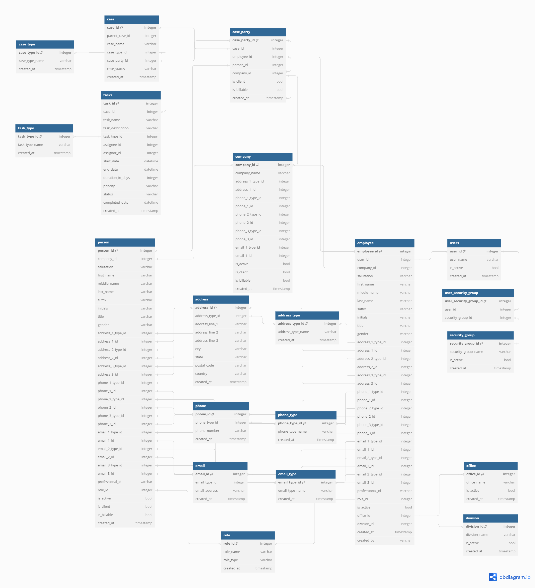

# Tanya Leonce's Personal Project Portfolio

This is the personal portfolio of Tanya Leonce's work to showcase her skills in the data space. You will find a variety of personal projects mainly focused on SQL and database skills.

## Data Integration Project

This data integration project will take a pipe delimited file and import it into a sample database. 
View more details here: [Data Integration Project](https://github.com/tleonce33/portfolio/blob/main/Data%20Integration%20Project/README.md)

## Data Architecture / Data Modeling

This data modeling project was designed to build a database that can be used for testing purposes. The database was modeled in dbdiagram.io for the ERD diagram, then tables were created and populated with dummy data usinf Python Faker library. 
View more details here: [Data Modeling Project](https://github.com/tleonce33/portfolio/blob/main/Data%20Model%20Project/README.md#data-modeling-project)

## Lessons Learned

As I am completing a Masters in Data Science and getting more exposure to new tools and languages, such as Python and R, it's been a a fun challenge to explore and incorporate new learning into old habits. It's helping to bridge the gaps in my knowledge of areas I would like to learn more about, such as data science, machine learning, and data engineering.

## Contact

Please feel free to contact me if you have any questions at: [LinkedIn](https://www.linkedin.com/in/tanya-leonce/)
